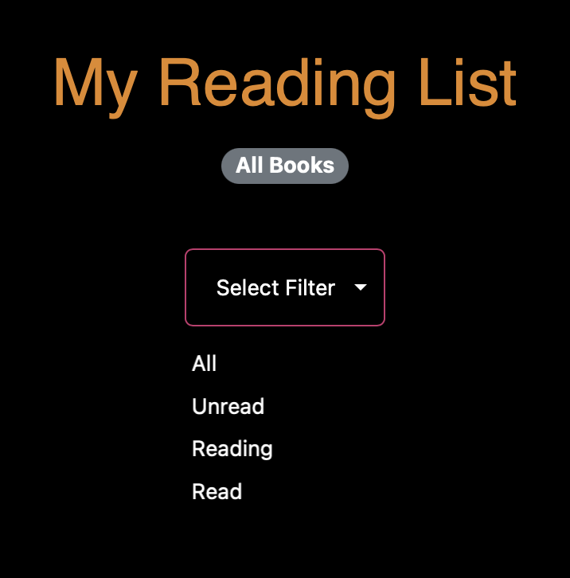

# Bookworm Web Application

**📚 Welcome to Bookworm! 📖**

**Bookworm** is an engaging web app built for book lovers everywhere! It offers a vast library of books from across the globe, allowing users to dive into the world of books with just a few clicks. 🌍✨

# Video Demo of application

[Youtube Link for video demo of app](https://youtu.be/U5m9-BXqwGI)

# Tech Stack

- **Frontend**: `React.js`, `Next.js`, `JavaScript`
- **Styling**: `CSS`, `Bootstrap`, `Tailwind CSS`
- **State Management**: `Jotai`
- **Backend**: `Flask`, `Python`
- **Database**: `PostgreSQL`
- **Authentication**: `Flask-JWT-Extended`
- **Image Handling**: `Cloudinary`
- **Containerization**: `Docker`, `Docker Compose`

## Important Libraries Used

- [Flask](https://flask.palletsprojects.com/en/2.2.x/)
- [Flask-Cors](https://flask-cors.readthedocs.io/en/latest/)
- [Flask-JWT-Extended](https://flask-jwt-extended.readthedocs.io/en/stable/)
- [Flask-SQLAlchemy](https://flask-sqlalchemy.palletsprojects.com/en/2.x/)
- [Cloudinary](https://cloudinary.com/documentation)
- [React.js](https://reactjs.org/docs/getting-started.html)
- [Next.js](https://nextjs.org/docs)
- [React Bootstrap](https://react-bootstrap.github.io/)
- [Tailwind](https://tailwindcss.com/docs/installation)
- [JWT-Decode](https://www.npmjs.com/package/jwt-decode)
- [Jotai](https://jotai.org/docs/introduction)

# App Functionality and UI - Deep Dive


## User Authentication and Authorization

- Users can register for an account by providing their `full name`, `email`, `username`, and `password`.
- Password validation ensures user safety by requiring at least one capital letter, number, and special character.
- The registration process includes robust error handling, displaying beautifully designed UI components to notify users of any registration failures.
- User authentication is handled securely using JWT tokens.
- Upon successful login, a JWT token is generated and stored in the client's local storage for subsequent requests.
- Registered users can log in using their credentials, and the JWT token provides access to protected routes and resources.
- JWT tokens act as sessions, eliminating the need for users to log in every time they access the website from the same device.
- Tokens have a default expiration period of one year, after which users are required to log in again for continued access, ensuring security and user convenience.

### Sign up page


### Login page


## Book Searching and Management

- The app provides users with a search feature to explore a database containing books from around the world.


- This is done using the Google Books API.
- Users can search for books by title, author, genre, or any other relevant criteria.


- Each book entry displays essential information such as title, author, publication date, summary, and cover image in the form of a card, which contains two options: `view` or `add to reading list`.


## Reading List Functionality

- Users can add books to their reading list, which categorizes books as `unread`, `reading`, or `read`.


- Users have the option to change the status of the book in the form of a small dropdown next to the status of the book on the book card.


- They can also filter books based on their status in their reading list.


- They can delete individual books or also have the option to delete all books at once.
- If there are no books in the reading list, the app prompts the user to explore books.
- The reading list functionality allows users to track their progress and manage their reading activities effectively.

## Book Ratings and Reviews

### Book Ratings and Review Page


- Users can rate books based on their reading experience using a star rating system.
- This page can be accessed when you search for a book on the explore page and then click on the view button. 
- This page contains a picture of the book, title, author, and a brief description about the book. All of the above come from the Google Books API.
- This page also shows the average rating and the reviews given by other people on the book.
- Additionally, users can leave reviews and comments on books, sharing their thoughts and opinions with the community.
- Ratings and reviews contribute to the overall rating of books, helping other users make informed decisions about their reading selections.
- Users can also delete the reviews that they posted but they do not have access to delete the reviews that other users posted.
- To avoid empty comments and no reviews, the post button will only be available when the user has enetered some text in the input field and has given a review.

## User Profile Management

- Users can view and manage their profiles, including personal information such as full name, username, email, and profile picture.


- The app also has security protocols in place so that the users can't access other people's profiles or change other people's profiles by just modifying the URL above in the status bar.

- Users also have the ability to edit their username, email, and profile pictures. Profile pictures can be uploaded from the user's device.


- The app also provides a feature for users to deactivate their accounts if they no longer wish to use the platform. If a user deactivates their account, all their data is deleted including the reviews posted by them, their reading list and their profile details.


# Running the Bookworm Web App Locally

I have not deployed this application simply because once deployed, the app requires a lot of maintenance to keep it running. 

This guide will help you set up and run the Bookworm web app on your local machine using Docker and Docker Compose. The application consists of a frontend and a backend service, with data storage managed through a PostgreSQL database and image storage through Cloudinary.

## Prerequisites

Before you begin, ensure you have the following installed on your local machine:

- **Docker**: Download and install Docker from [https://www.docker.com/get-started](https://www.docker.com/get-started).
- **Docker Compose**: Usually included with Docker Desktop for Windows and Mac. For Linux, you may need to install it separately. Instructions can be found [here](https://docs.docker.com/compose/install/).

Additionally, you will need:

- A **Google Books API Key**: Follow the steps at [https://developers.google.com/books/docs/v1/using#APIKey](https://developers.google.com/books/docs/v1/using#APIKey) to obtain an API key.
- **PostgreSQL Cloud Instance Credentials**: You can create a free PostgreSQL database at services like ElephantSQL ([https://www.elephantsql.com/](https://www.elephantsql.com/)).
- A **Cloudinary Account** for image uploads: Sign up at [https://cloudinary.com/users/register/free](https://cloudinary.com/users/register/free) and obtain your Cloudinary `Cloud Name`, `API Key`, and `API Secret`.

## Configuration

1. **Clone the Repository**: Clone the project repository to your local machine.

2. **Set Up Environment Variables**: Update the `docker-compose.yml` file with your credentials:
   - Replace `NEXT_PUBLIC_REACT_APP_GOOGLE_BOOKS_API_KEY` with your Google Books API Key.
   - Populate the PostgreSQL database credentials (`POSTGRES_DB_USERNAME`, `POSTGRES_DB_PASSWORD`) with the ones obtained from your PostgreSQL cloud instance.
   - Fill in the Cloudinary credentials (`CLOUDINARY_CLOUD_NAME`, `CLOUDINARY_API_KEY`, `CLOUDINARY_API_SECRET`) with your account details.
   - Populate the `JWT_SECRET_KEY` with a randomly generated string that will be used to encrypt your JWT tokens.

    Here's an example snippet from the `docker-compose.yml` file:

    ```yaml
    version: '3.8'

    services:
    frontend:
        build: ./bkwrm_frontend
        ports:
        - "3000:3000"
        depends_on:
        - backend
        environment:
        - NEXT_PUBLIC_API_URL=http://localhost:8000
        - NEXT_PUBLIC_REACT_APP_GOOGLE_BOOKS_API_KEY=your_google_books_api_key_here

    backend:
        build: ./bkwrm_backend
        ports:
        - "8000:8000"
        environment:
        - POSTGRES_DB_USERNAME=your_postgres_username
        - POSTGRES_DB_PASSWORD=your_postgres_password
        - JWT_SECRET_KEY=your_jwt_secret_key
        - CLOUDINARY_CLOUD_NAME=your_cloudinary_cloud_name
        - CLOUDINARY_API_KEY=your_cloudinary_api_key
        - CLOUDINARY_API_SECRET=your_cloudinary_api_secret
        - GOOGLE_BOOKS_API_KEY=your_google_books_api_key_here
    ```

## Running the Application

After configuring your environment variables:

1. Open a Terminal or Command Prompt in the project root directory.
2. Run Docker Compose:
    ```bash
    docker-compose up --build
    ```
    This command builds and starts the frontend and backend services, making them accessible at http://localhost:3000 and http://localhost:8000 respectively.

## Accessing the App

Once the application is running, you can access the frontend by navigating to http://localhost:3000 in your web browser. The backend API will be available at http://localhost:8000.


You now have the Bookworm web app running locally on your machine. This setup is intended for development and testing purposes. For production deployment, consider using a production-ready setup with a proper WSGI server for the backend and a database managed by a reliable cloud provider.

# Potential Future Improvements

The following enhancements are proposed to elevate the user experience and functionality of the Bookworm web app, prioritized by their potential impact:

- **Enhanced Authentication Handling**: Implement more robust authentication mechanisms to improve security and user management. This includes adding email confirmation to ensure users provide valid email addresses during registration, preventing misuse and enhancing account security.
  
- **Social Sign-In Integration**: Enable sign-in using Google or other social media platforms on the sign-up page, offering users a streamlined and more convenient login experience.
  
- **AI-Powered Book Recommendations**: Introduce an AI assistant to help users find books based on the vibe and feel of their input prompts, enhancing the book discovery process.
  
- **Interactive Data Visualizations**: Develop visualizations on the book explore page showing how many users have added a particular book to their reading list, providing insights into popular titles and fostering a community feel.
  
- **Search Functionality in Reading List**: Add a search feature within the reading list, allowing users to easily find specific books in their collection, improving navigation and user satisfaction.
  
- **UI Enhancements**: Continuously improve the user interface for a more intuitive and visually appealing experience, focusing on usability and design consistency.
  
- **Redis for Caching**: Utilize Redis for caching frequently accessed data, significantly reducing load times and improving the overall performance of the website.
  
- **Confirmation Dialogues for Critical Actions**: Introduce confirmation prompts for actions like deactivation or logout, giving users a moment to reconsider their decision and preventing accidental account changes.

## Author
[Aryan Khurana](https://github.com/AryanK1511)