# App Functionality and UI - Deep Dive

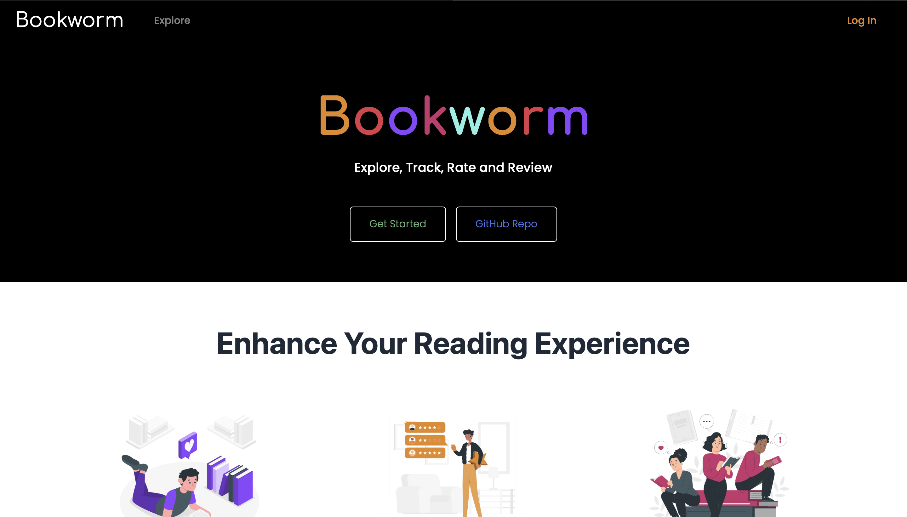

## User Authentication and Authorization

- Users can register for an account by providing their full name, email, username, and password.
- Password validation ensures user safety by requiring at least one capital letter, number, and special character.
- The registration process includes robust error handling, displaying beautifully designed UI components to notify users of any registration failures.
- User authentication is handled securely using JWT tokens.
- Upon successful login, a JWT token is generated and stored in the client's local storage for subsequent requests.
- Registered users can log in using their credentials, and the JWT token provides access to protected routes and resources.
- JWT tokens act as sessions, eliminating the need for users to log in every time they access the website from the same device.
- Tokens have a default expiration period of one year, after which users are required to log in again for continued access, ensuring security and user convenience.

### Sign up page

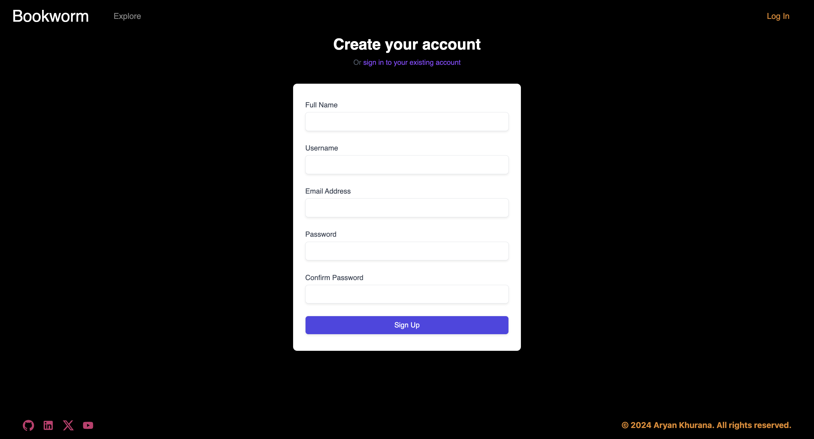

### Login page

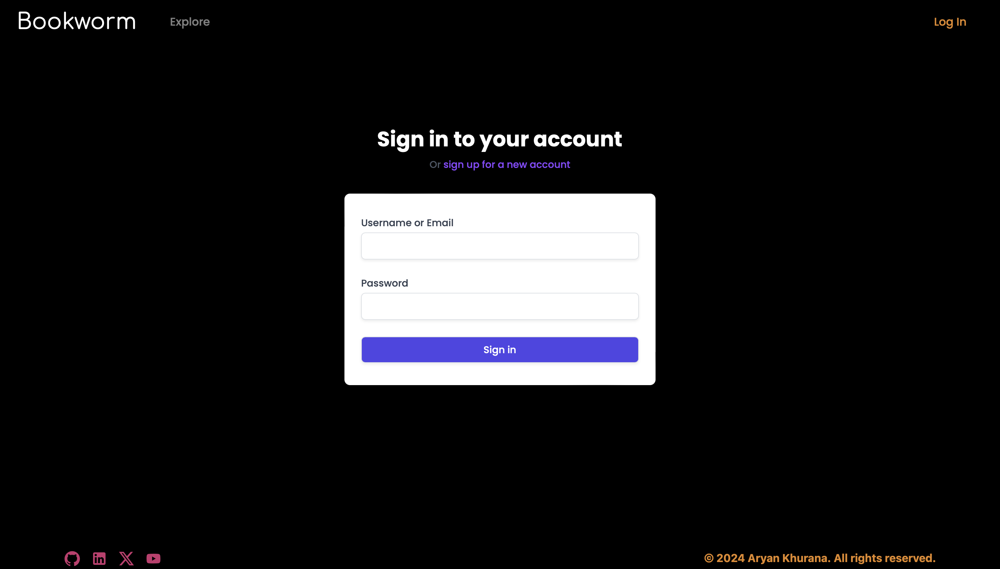

## Book Searching and Management

- The app provides users with a search feature to explore a database containing books from around the world.
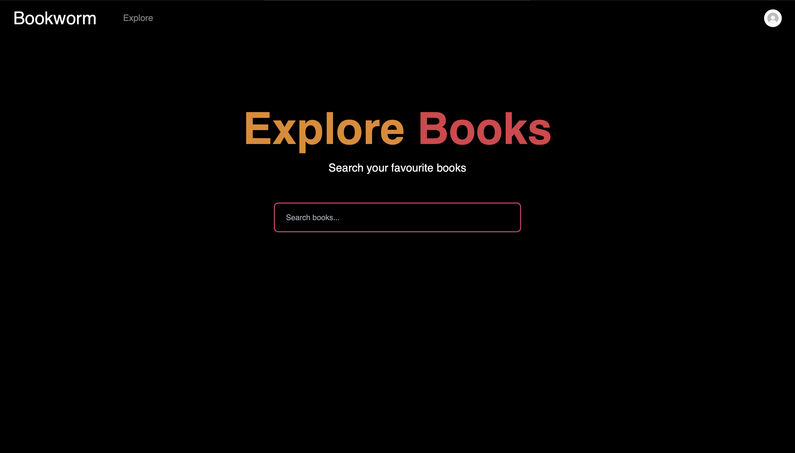

- This is done using the Google Books API.
- Users can search for books by title, author, genre, or any other relevant criteria.
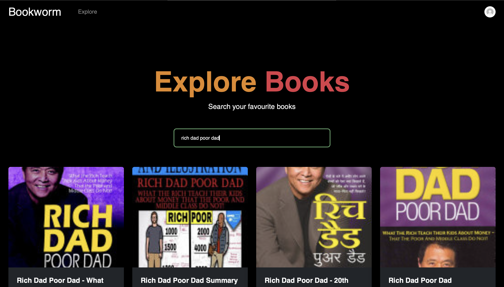

- Each book entry displays essential information such as title, author, publication date, summary, and cover image in the form of a card, which contains two options: view or add to reading list.
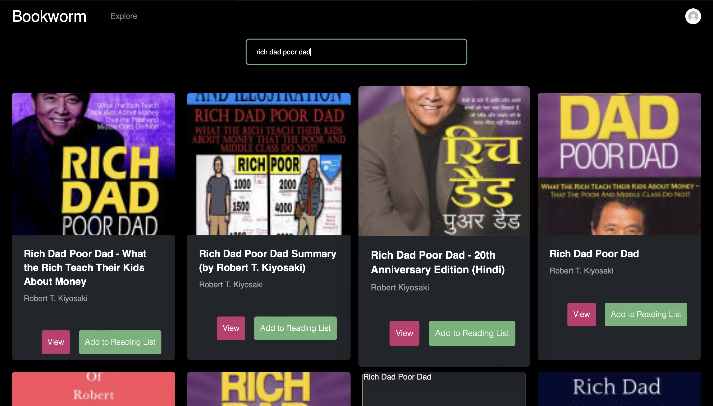

## Reading List Functionality

- Users can add books to their reading list, which categorizes books as `unread`, `reading`, or `read`.
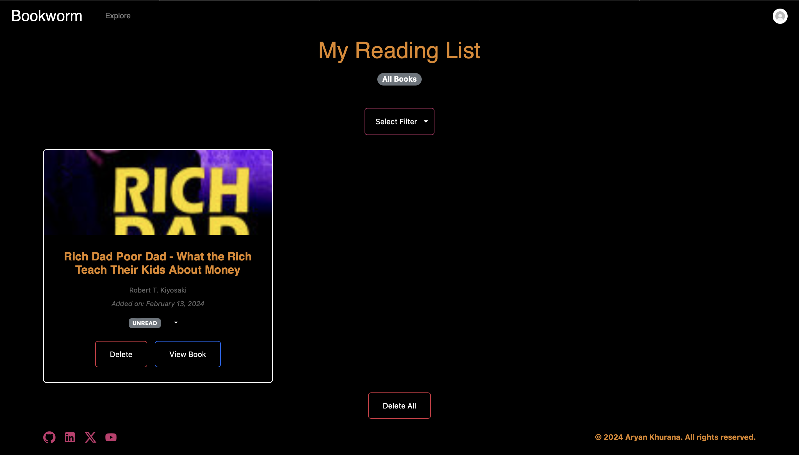

- Users have the option to change the status of the book in the form of a small dropdown next to the status of the book on the book card.
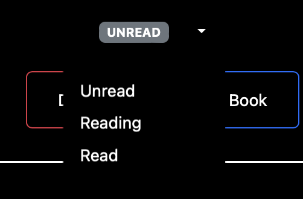

- They can also filter books based on their status in their reading list.
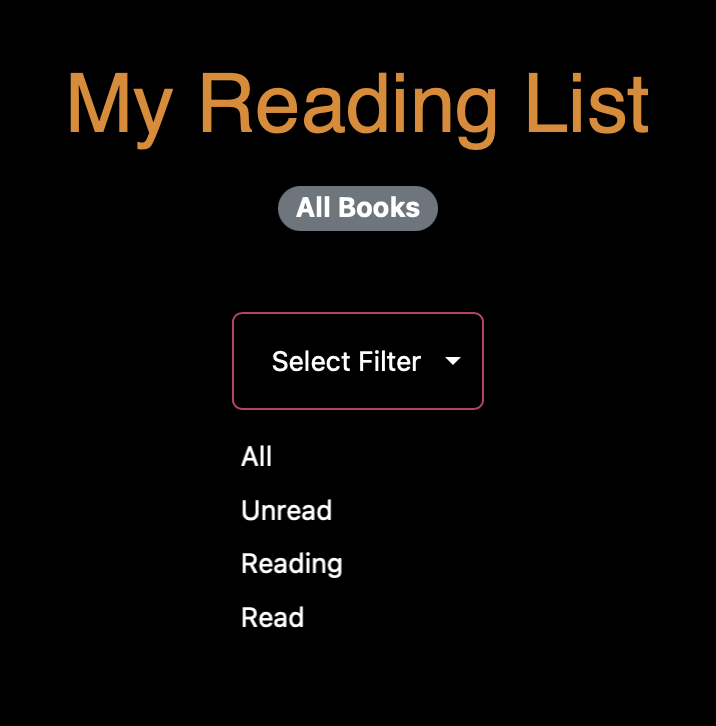

- They can delete individual books or also have the option to delete all books at once.
- If there are no books in the reading list, the app prompts the user to explore books.
- The reading list functionality allows users to track their progress and manage their reading activities effectively.

## Book Ratings and Reviews

### Book Ratings and Review Page
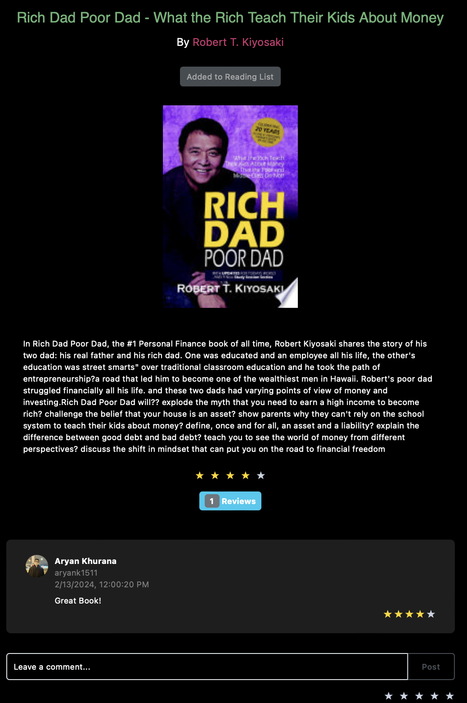

- Users can rate books based on their reading experience using a star rating system.
- This page can be accessed when you search for a book on the explore page and then click on the view button. 
- This page contains a picture of the book, title, author, and a brief description about the book. All of the above come from the Google Books API.
- This page also shows the average rating and the reviews given by other people on the book.
- Additionally, users can leave reviews and comments on books, sharing their thoughts and opinions with the community.
- Ratings and reviews contribute to the overall rating of books, helping other users make informed decisions about their reading selections.
- Users can also delete the reviews that they posted but they do not have access to delete the reviews that other users posted.
- To avoid empty comments and no reviews, the post button will only be available when the user has enetered some text in the input field and has given a review.

## User Profile Management

- Users can view and manage their profiles, including personal information such as full name, username, email, and profile picture.
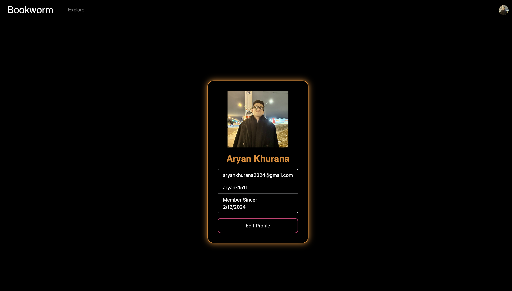

- The app also has security protocols in place so that the users can't access other people's profiles or change other people's profiles by just modifying the URL above in the status bar.

- Users also have the ability to edit their username, email, and profile pictures. Profile pictures can be uploaded from the user's device.
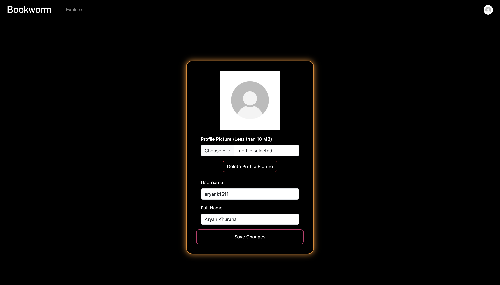

- The app also provides a feature for users to deactivate their accounts if they no longer wish to use the platform. If a user deactivates their account, all their data is deleted including the reviews posted by them, their reading list and their profile details.
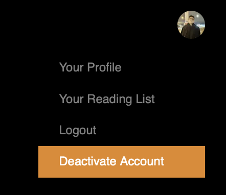

## Author
[Aryan Khurana](https://github.com/AryanK1511)